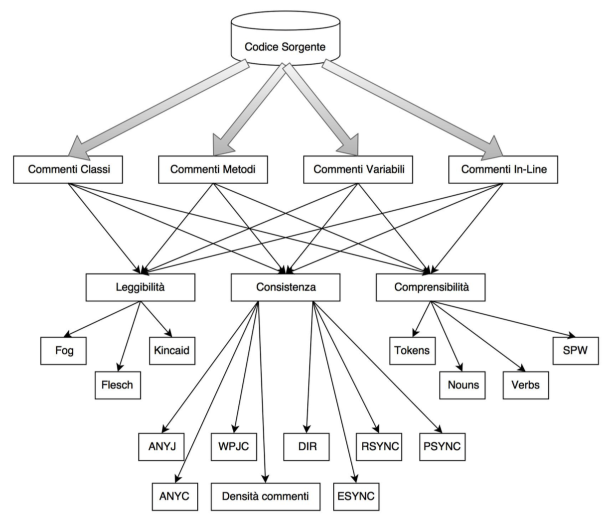
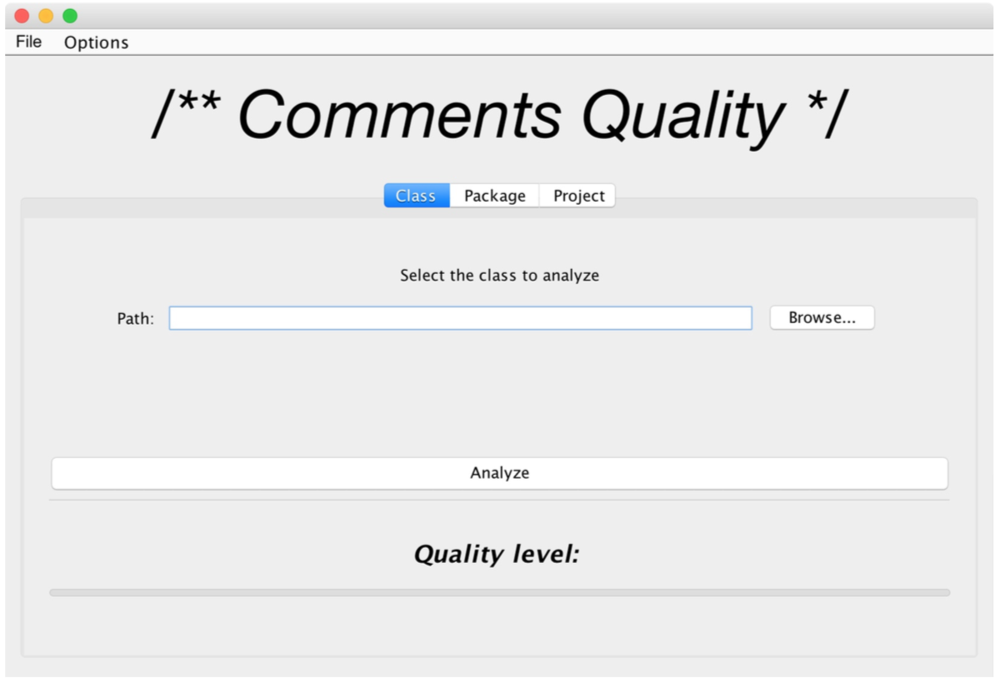
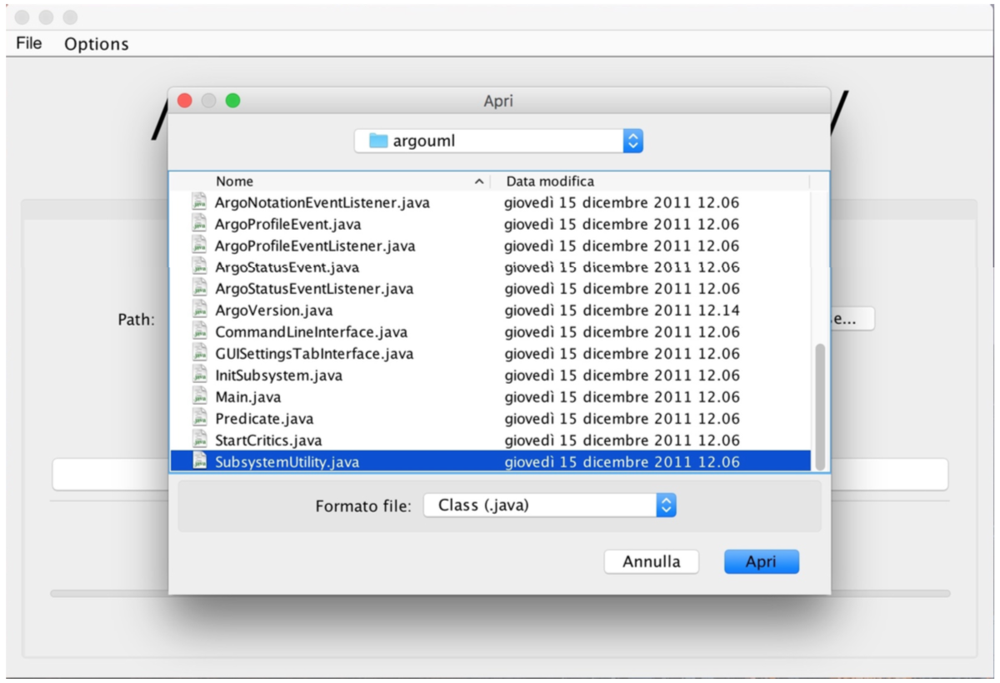
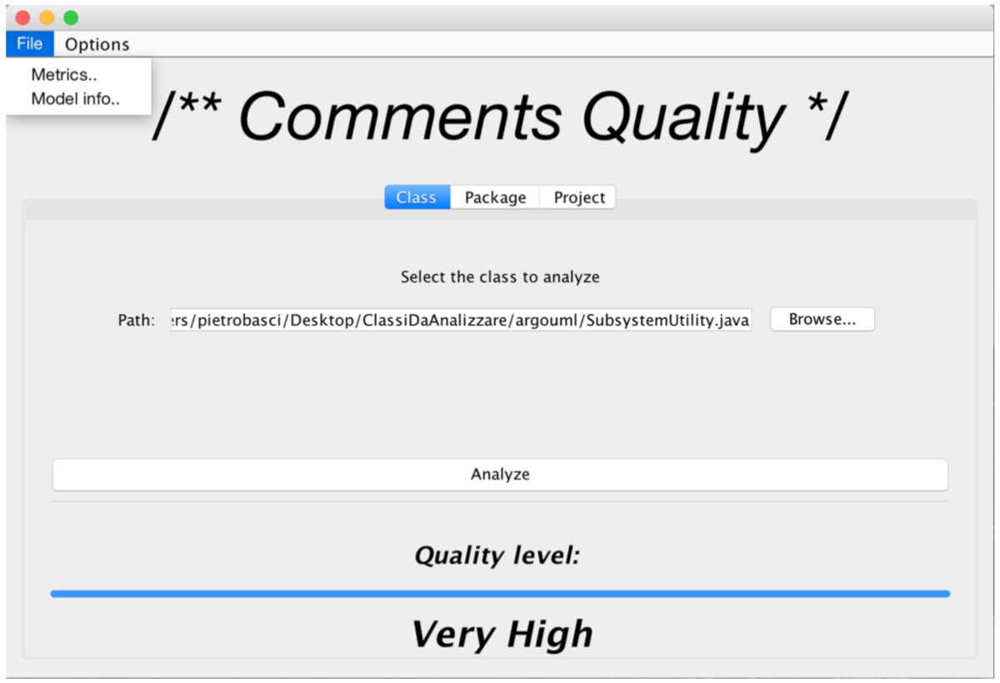
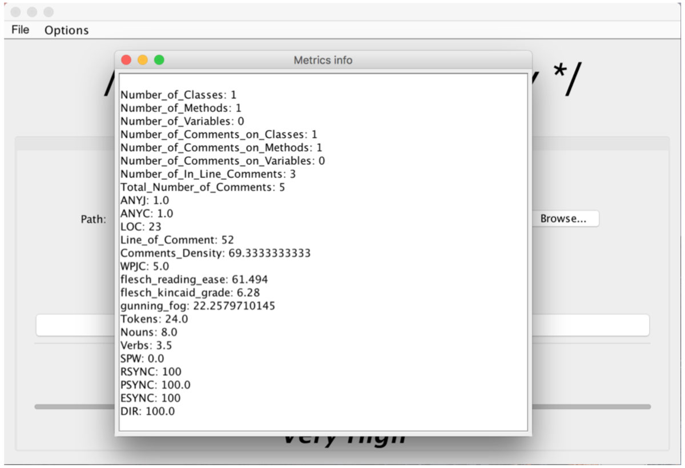
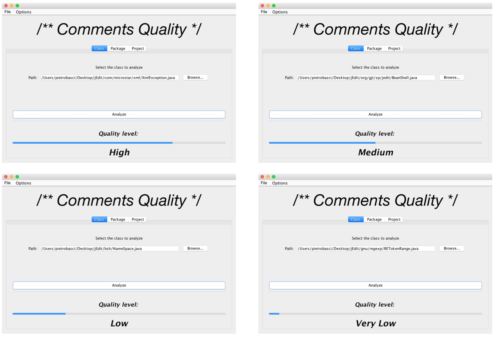
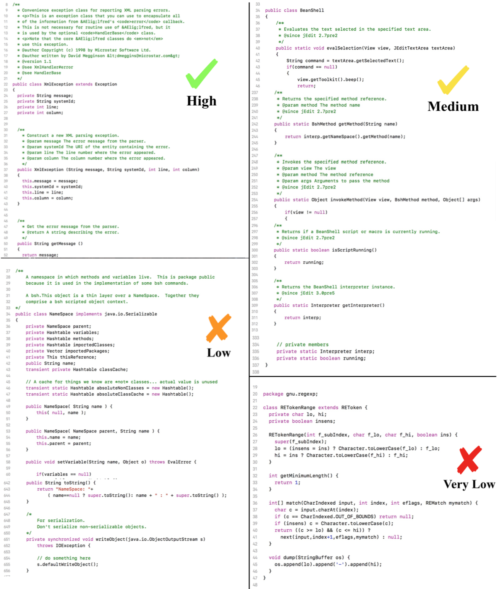

# Comments Quality

Final project for my BSc Thesis - Computer Engineering @Università degli Studi del Sannio.

 

The objective of this work is to build a Machine Learning based tool to assess the quality of comments in Java source code. The system exploits some Python scripts to extract comments from all java files inside the analyzed project and to compute some "hand-crafted" features used by an ML model to assign a quality level. 

 

<figure>

<figcaption>Features extracted</figcaption>

</figure>

  

<figure>

<figcaption>Sceenshoot 1</figcaption>

</figure>

  

<figure>

<figcaption>Sceenshoot 2</figcaption>

</figure>

  

<figure>

<figcaption>Sceenshoot 3</figcaption>

</figure>

  

<figure>

<figcaption>Sceenshoot 4</figcaption>

</figure>

  

<figure>

<figcaption>Sceenshoot 5</figcaption>

</figure>

  

<figure>

<figcaption>Sceenshoot 6</figcaption>

</figure>

  
